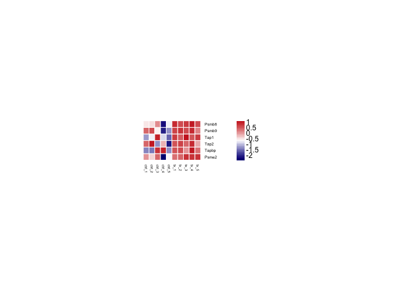
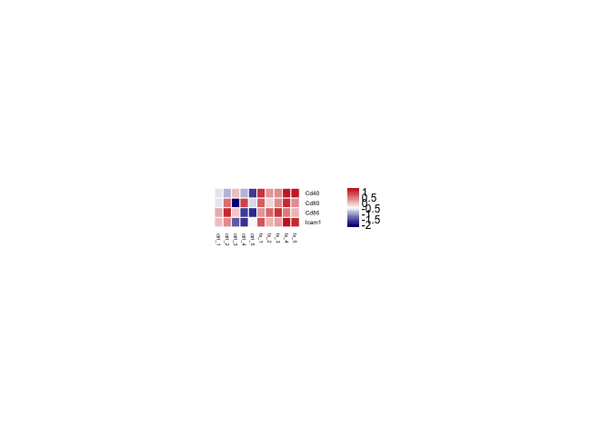

Analysis of CD11c+ enriched draining lymph node cells in RGX-104 vs ctrl
chow treated animals
================

## Load libraries

``` r
## Load libraries
library(DESeq2)
library(NMF)
library(tidyverse)
```

## Read in data

``` r
## Get read counts
read_counts <- read.csv("counts.csv", header = TRUE, row.names = 1)

## Create DESeq2 object
condition <- factor(c(rep("ctrl", 5), rep("tx", 5)), levels = c("ctrl", "tx"))
sample_info <- data.frame(condition = condition, 
                          row.names = names(read_counts))
dds <- DESeqDataSetFromMatrix(countData = read_counts,
                              colData = sample_info,
                              design = ~ condition)
```

## Read count transformations

``` r
## Remove genes with 0 counts
dds <- dds[rowSums(counts(dds)) > 0, ]

## Normalize read counts to library size
dds <- estimateSizeFactors(dds)
counts_norm <- counts(dds, normalized = TRUE)

## log2-transform normalized read counts using a pseudocount of 1
counts_norm_log <- 
  log2(counts_norm + 1) |>
  as.data.frame()
```

# Heatmaps

``` r
## Define gene sets
gene_sets <- list()
gene_sets$MHC_genes <- c("H2-D1", "H2-K1","B2m", "H2-Aa", "H2-Ab1", "H2-Eb1", "H2-Eb2") 
gene_sets$antigen_pres <- c("Psmb8", "Psmb9", "Tap1", "Tap2", "Tapbp", "Psme2")
gene_sets$costimulation <- c("Cd40", "Cd80", "Cd86", "Icam1")

## Plot heatmaps
plot_hm <- function(counts_norm, gene_set){
  plot_hm <-
    aheatmap(counts_norm[gene_set,],
             scale = "row",
             color = colorRampPalette(c("navy", "white", "firebrick3"))(50),
             fontsize = 9,
             cexRow = 1,
             cexCol = 0.5,
             cellwidth = 7,
             cellheight = 8,
             border_color = "white",
             width = 2.5,
             height = 1.5,
             Colv = NA, 
             Rowv = NA)
}

plot_hm(counts_norm_log, gene_sets$MHC_genes)
```

<!-- -->

``` r
plot_hm(counts_norm_log, gene_sets$antigen_pres)
```

<!-- -->

``` r
plot_hm(counts_norm_log, gene_sets$costimulation)
```

<!-- -->

## Session info

``` r
devtools::session_info()
```

    ## ─ Session info ───────────────────────────────────────────────────────────────
    ##  setting  value
    ##  version  R version 4.3.0 (2023-04-21)
    ##  os       macOS 14.1.2
    ##  system   x86_64, darwin20
    ##  ui       X11
    ##  language (EN)
    ##  collate  en_US.UTF-8
    ##  ctype    en_US.UTF-8
    ##  tz       Europe/Berlin
    ##  date     2023-12-04
    ##  pandoc   3.1.1 @ /Applications/RStudio.app/Contents/Resources/app/quarto/bin/tools/ (via rmarkdown)
    ## 
    ## ─ Packages ───────────────────────────────────────────────────────────────────
    ##  package              * version   date (UTC) lib source
    ##  Biobase              * 2.60.0    2023-04-25 [1] Bioconductor
    ##  BiocGenerics         * 0.46.0    2023-04-25 [1] Bioconductor
    ##  BiocManager            1.30.20   2023-02-24 [1] CRAN (R 4.3.0)
    ##  BiocParallel           1.34.0    2023-04-25 [1] Bioconductor
    ##  bitops                 1.0-7     2021-04-24 [1] CRAN (R 4.3.0)
    ##  cachem                 1.0.7     2023-02-24 [1] CRAN (R 4.3.0)
    ##  callr                  3.7.3     2022-11-02 [1] CRAN (R 4.3.0)
    ##  cli                    3.6.1     2023-03-23 [1] CRAN (R 4.3.0)
    ##  cluster              * 2.1.4     2022-08-22 [1] CRAN (R 4.3.0)
    ##  codetools              0.2-19    2023-02-01 [1] CRAN (R 4.3.0)
    ##  colorspace             2.1-0     2023-01-23 [1] CRAN (R 4.3.0)
    ##  crayon                 1.5.2     2022-09-29 [1] CRAN (R 4.3.0)
    ##  DelayedArray           0.25.0    2022-11-01 [1] Bioconductor
    ##  DESeq2               * 1.40.0    2023-04-25 [1] Bioconductor
    ##  devtools               2.4.5     2022-10-11 [1] CRAN (R 4.3.0)
    ##  digest                 0.6.31    2022-12-11 [1] CRAN (R 4.3.0)
    ##  doParallel             1.0.17    2022-02-07 [1] CRAN (R 4.3.0)
    ##  dplyr                * 1.1.2     2023-04-20 [1] CRAN (R 4.3.0)
    ##  ellipsis               0.3.2     2021-04-29 [1] CRAN (R 4.3.0)
    ##  evaluate               0.20      2023-01-17 [1] CRAN (R 4.3.0)
    ##  fansi                  1.0.4     2023-01-22 [1] CRAN (R 4.3.0)
    ##  fastmap                1.1.1     2023-02-24 [1] CRAN (R 4.3.0)
    ##  forcats              * 1.0.0     2023-01-29 [1] CRAN (R 4.3.0)
    ##  foreach                1.5.2     2022-02-02 [1] CRAN (R 4.3.0)
    ##  fs                     1.6.2     2023-04-25 [1] CRAN (R 4.3.0)
    ##  generics               0.1.3     2022-07-05 [1] CRAN (R 4.3.0)
    ##  GenomeInfoDb         * 1.36.0    2023-04-25 [1] Bioconductor
    ##  GenomeInfoDbData       1.2.10    2023-05-01 [1] Bioconductor
    ##  GenomicRanges        * 1.52.0    2023-04-25 [1] Bioconductor
    ##  ggplot2              * 3.4.2     2023-04-03 [1] CRAN (R 4.3.0)
    ##  glue                   1.6.2     2022-02-24 [1] CRAN (R 4.3.0)
    ##  gridBase               0.4-7     2014-02-24 [1] CRAN (R 4.3.0)
    ##  gtable                 0.3.3     2023-03-21 [1] CRAN (R 4.3.0)
    ##  highr                  0.10      2022-12-22 [1] CRAN (R 4.3.0)
    ##  hms                    1.1.3     2023-03-21 [1] CRAN (R 4.3.0)
    ##  htmltools              0.5.5     2023-03-23 [1] CRAN (R 4.3.0)
    ##  htmlwidgets            1.6.2     2023-03-17 [1] CRAN (R 4.3.0)
    ##  httpuv                 1.6.9     2023-02-14 [1] CRAN (R 4.3.0)
    ##  IRanges              * 2.34.0    2023-04-25 [1] Bioconductor
    ##  iterators              1.0.14    2022-02-05 [1] CRAN (R 4.3.0)
    ##  knitr                  1.42      2023-01-25 [1] CRAN (R 4.3.0)
    ##  later                  1.3.0     2021-08-18 [1] CRAN (R 4.3.0)
    ##  lattice                0.21-8    2023-04-05 [1] CRAN (R 4.3.0)
    ##  lifecycle              1.0.3     2022-10-07 [1] CRAN (R 4.3.0)
    ##  locfit                 1.5-9.7   2023-01-02 [1] CRAN (R 4.3.0)
    ##  lubridate            * 1.9.2     2023-02-10 [1] CRAN (R 4.3.0)
    ##  magrittr               2.0.3     2022-03-30 [1] CRAN (R 4.3.0)
    ##  Matrix                 1.5-4     2023-04-04 [1] CRAN (R 4.3.0)
    ##  MatrixGenerics       * 1.12.0    2023-04-25 [1] Bioconductor
    ##  matrixStats          * 0.63.0    2022-11-18 [1] CRAN (R 4.3.0)
    ##  memoise                2.0.1     2021-11-26 [1] CRAN (R 4.3.0)
    ##  mime                   0.12      2021-09-28 [1] CRAN (R 4.3.0)
    ##  miniUI                 0.1.1.1   2018-05-18 [1] CRAN (R 4.3.0)
    ##  munsell                0.5.0     2018-06-12 [1] CRAN (R 4.3.0)
    ##  NMF                  * 0.26      2023-03-20 [1] CRAN (R 4.3.0)
    ##  pillar                 1.9.0     2023-03-22 [1] CRAN (R 4.3.0)
    ##  pkgbuild               1.4.0     2022-11-27 [1] CRAN (R 4.3.0)
    ##  pkgconfig              2.0.3     2019-09-22 [1] CRAN (R 4.3.0)
    ##  pkgload                1.3.2     2022-11-16 [1] CRAN (R 4.3.0)
    ##  plyr                   1.8.8     2022-11-11 [1] CRAN (R 4.3.0)
    ##  prettyunits            1.1.1     2020-01-24 [1] CRAN (R 4.3.0)
    ##  processx               3.8.1     2023-04-18 [1] CRAN (R 4.3.0)
    ##  profvis                0.3.7     2020-11-02 [1] CRAN (R 4.3.0)
    ##  promises               1.2.0.1   2021-02-11 [1] CRAN (R 4.3.0)
    ##  ps                     1.7.5     2023-04-18 [1] CRAN (R 4.3.0)
    ##  purrr                * 1.0.1     2023-01-10 [1] CRAN (R 4.3.0)
    ##  R6                     2.5.1     2021-08-19 [1] CRAN (R 4.3.0)
    ##  RColorBrewer           1.1-3     2022-04-03 [1] CRAN (R 4.3.0)
    ##  Rcpp                   1.0.10    2023-01-22 [1] CRAN (R 4.3.0)
    ##  RCurl                  1.98-1.12 2023-03-27 [1] CRAN (R 4.3.0)
    ##  readr                * 2.1.4     2023-02-10 [1] CRAN (R 4.3.0)
    ##  registry             * 0.5-1     2019-03-05 [1] CRAN (R 4.3.0)
    ##  remotes                2.4.2     2021-11-30 [1] CRAN (R 4.3.0)
    ##  reshape2               1.4.4     2020-04-09 [1] CRAN (R 4.3.0)
    ##  rlang                  1.1.1     2023-04-28 [1] CRAN (R 4.3.0)
    ##  rmarkdown              2.21      2023-03-26 [1] CRAN (R 4.3.0)
    ##  rngtools             * 1.5.2     2021-09-20 [1] CRAN (R 4.3.0)
    ##  rstudioapi             0.14      2022-08-22 [1] CRAN (R 4.3.0)
    ##  S4Vectors            * 0.38.0    2023-04-25 [1] Bioconductor
    ##  scales                 1.2.1     2022-08-20 [1] CRAN (R 4.3.0)
    ##  sessioninfo            1.2.2     2021-12-06 [1] CRAN (R 4.3.0)
    ##  shiny                  1.7.4     2022-12-15 [1] CRAN (R 4.3.0)
    ##  stringi                1.7.12    2023-01-11 [1] CRAN (R 4.3.0)
    ##  stringr              * 1.5.0     2022-12-02 [1] CRAN (R 4.3.0)
    ##  SummarizedExperiment * 1.30.0    2023-04-25 [1] Bioconductor
    ##  tibble               * 3.2.1     2023-03-20 [1] CRAN (R 4.3.0)
    ##  tidyr                * 1.3.0     2023-01-24 [1] CRAN (R 4.3.0)
    ##  tidyselect             1.2.0     2022-10-10 [1] CRAN (R 4.3.0)
    ##  tidyverse            * 2.0.0     2023-02-22 [1] CRAN (R 4.3.0)
    ##  timechange             0.2.0     2023-01-11 [1] CRAN (R 4.3.0)
    ##  tzdb                   0.4.0     2023-05-12 [1] CRAN (R 4.3.0)
    ##  urlchecker             1.0.1     2021-11-30 [1] CRAN (R 4.3.0)
    ##  usethis                2.1.6     2022-05-25 [1] CRAN (R 4.3.0)
    ##  utf8                   1.2.3     2023-01-31 [1] CRAN (R 4.3.0)
    ##  vctrs                  0.6.2     2023-04-19 [1] CRAN (R 4.3.0)
    ##  withr                  2.5.0     2022-03-03 [1] CRAN (R 4.3.0)
    ##  xfun                   0.39      2023-04-20 [1] CRAN (R 4.3.0)
    ##  xtable                 1.8-4     2019-04-21 [1] CRAN (R 4.3.0)
    ##  XVector                0.40.0    2023-04-25 [1] Bioconductor
    ##  yaml                   2.3.7     2023-01-23 [1] CRAN (R 4.3.0)
    ##  zlibbioc               1.46.0    2023-04-25 [1] Bioconductor
    ## 
    ##  [1] /Library/Frameworks/R.framework/Versions/4.3-x86_64/Resources/library
    ## 
    ## ──────────────────────────────────────────────────────────────────────────────
