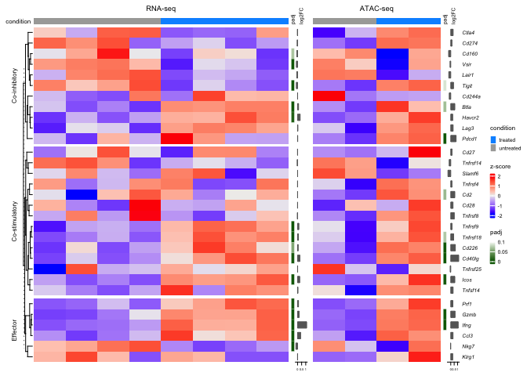
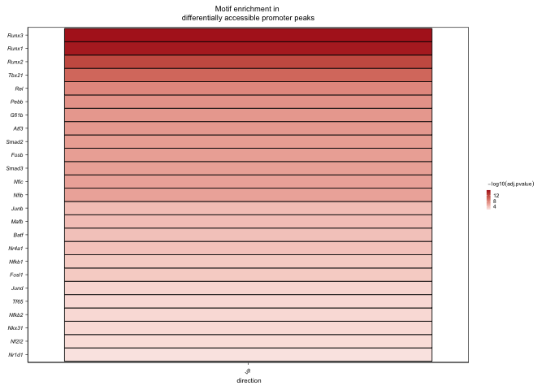

ATACseq of OT-I upon crosspresentation
================
Benjamin Ostendorf
3/20/2021

## Preamble

``` r
library(DiffBind)
library(ChIPseeker)
library(TxDb.Mmusculus.UCSC.mm10.knownGene)
library(org.Mm.eg.db)
library(ComplexHeatmap)
library(memes)
library(BSgenome.Mmusculus.UCSC.mm10)
library(tidyverse)

txdb <- TxDb.Mmusculus.UCSC.mm10.knownGene

source("helper_functions.R")
```

``` r
## --------------------------------------------------------
## Import and calculate
## --------------------------------------------------------
if (!file.exists("diffbind_output.rds")) {
  sample_sheet <- 
    tibble(SampleID = c("ctrl_01", "ctrl_02", "tx_01", "tx_02"), 
           Condition = c("ctrl", "ctrl", "tx", "tx"), 
           Replicate = c(1, 2, 1, 2), 
           bamReads = c("../../workflow/results/remove-chrM/ctrl_01.bam", 
                        "../../workflow/results/remove-chrM/ctrl_02.bam", 
                        "../../workflow/results/remove-chrM/tx_02.bam", 
                        "../../workflow/results/remove-chrM/tx_02.bam"), 
           Peaks = c("../data/processed/ctrl.narrowPeak",
                     "../data/processed/ctrl.narrowPeak",
                     "../data/processed/tx.narrowPeak",
                     "../data/processed/tx.narrowPeak"), 
           PeakCaller = c("narrow", "narrow", "narrow", "narrow"))
  df <- dba(sampleSheet = sample_sheet)

  ## Count reads
  df <- dba.count(df)

  ## Normalize
  df <- dba.normalize(df)

  ## Define contrast and run differential analysis
  df <- dba.contrast(df, minMembers = 2, categories = DBA_CONDITION)
  df <- dba.analyze(df, method = DBA_ALL_METHODS)
  
  saveRDS(df, file = "diffbind_output.rds")
}
```

## Import and wrangle

``` r
## ------------------------------------------------------------
## Import peaksets
## ------------------------------------------------------------
df <- readRDS("diffbind_output.rds")

## Extract peaks for all replicates
peaks <- dba.peakset(df, bRetrieve = TRUE)
peaks$id <- rownames(mcols(peaks))

## ------------------------------------------------------------
## Differential peak analysis results
## ------------------------------------------------------------
## Set default analysis in dba object (DESeq2 vs edgeR) and FDR cutoff
df$config$AnalysisMethod <- "edgeR"
df$config$th <- 0.1

## Extract different accessibility results (all peaks regardless of sig)
peaks_res <- dba.report(df, th = 1)
peaks_res$id <- rownames(mcols(peaks_res))

## ------------------------------------------------------------
## Change chr names from NCBI to UCSC for GRanges objects
## ------------------------------------------------------------
NCBItoUCSC_df <- read_tsv("NCBI_UCSC_chrom_conv.txt", col_names = c("NCBI", "UCSC"))
NCBItoUCSC <- as.character(NCBItoUCSC_df$UCSC)
names(NCBItoUCSC) <- NCBItoUCSC_df$NCBI

peaks_res <- renameSeqlevels(peaks_res, NCBItoUCSC)
peaks <- renameSeqlevels(peaks, NCBItoUCSC)

## ------------------------------------------------------------
## Annotate peaks for results and raw peaks
## ------------------------------------------------------------
peaks_anno <- annotatePeak(peaks, tssRegion = c(-3000, 3000),
                           TxDb = txdb, annoDb = "org.Mm.eg.db")
```

    ## >> preparing features information...      2023-12-06 13:27:43 
    ## >> identifying nearest features...        2023-12-06 13:27:44 
    ## >> calculating distance from peak to TSS...   2023-12-06 13:27:46 
    ## >> assigning genomic annotation...        2023-12-06 13:27:46 
    ## >> adding gene annotation...          2023-12-06 13:28:04 
    ## >> assigning chromosome lengths           2023-12-06 13:28:05 
    ## >> done...                    2023-12-06 13:28:05

``` r
peaks <- peaks_anno@anno
peaks <- plyranges::mutate(peaks, symbol = SYMBOL)


peaks_res_anno <- annotatePeak(peaks_res, tssRegion = c(-3000, 3000),
                               TxDb = txdb, annoDb = "org.Mm.eg.db")
```

    ## >> preparing features information...      2023-12-06 13:28:05 
    ## >> identifying nearest features...        2023-12-06 13:28:05 
    ## >> calculating distance from peak to TSS...   2023-12-06 13:28:07 
    ## >> assigning genomic annotation...        2023-12-06 13:28:07 
    ## >> adding gene annotation...          2023-12-06 13:28:10 
    ## >> assigning chromosome lengths           2023-12-06 13:28:10 
    ## >> done...                    2023-12-06 13:28:10

``` r
peaks_res <- peaks_res_anno@anno
peaks_res <- plyranges::mutate(peaks_res, symbol = SYMBOL)

## ------------------------------------------------------------
## Extract significant peaks from all peaks
## ------------------------------------------------------------
peaks_res_sig <- peaks_res[peaks_res$FDR < 0.1]
peak_IDs_sig <- rownames(mcols(peaks_res_sig))
peaks_IDs_sig_up <- mcols(peaks_res[peaks_res$FDR < 0.1 & peaks_res$Fold > 0])$id
peaks_IDs_sig_dn <- mcols(peaks_res[peaks_res$FDR < 0.1 & peaks_res$Fold < 0])$id

peaks_sig <- peaks[peak_IDs_sig, ]
peaks_sig_up <- peaks[peaks_IDs_sig_up, ]

peaks_sig_dedup_top <-
  peaks_sig_up |>
  as.data.frame() |>
  distinct(symbol, .keep_all = TRUE) |>
  slice(1:100)

## Annotate main peaks dataframe depending on differential analysis result
peaks <-
  peaks |>
  plyranges::mutate(direction = case_when(id %in% peaks_IDs_sig_up ~ "up", 
                                          id %in% peaks_IDs_sig_dn ~ "dn", 
                                          TRUE ~ "n.s."))
```

## Heatmap for RNA-seq results

``` r
## Import RNAseq data
resLFC_RNAseq <- read_tsv("../../Fig6_RNAseq/R/resLFC_RNAseq.tsv")
counts_scaled_RNAseq_tibble <- read_tsv("../../Fig6_RNAseq/R/counts_scaled_RNAseq.tsv")
counts_scaled_RNAseq <- as.matrix(select(counts_scaled_RNAseq_tibble, -1))
rownames(counts_scaled_RNAseq) <- counts_scaled_RNAseq_tibble$symbol
  

## List of curated genes (from Chen and Flies, Nature Reviews, Immunol, 2013)
curated_genes <- list(
  `Co-stimulatory` = c("Cd28", "Icos", "Cd27", "Tnfrsf14", "Tnfsf14",  "Cd40lg", "Tnfrsf9", "Tnfrsf4", "Tnfrsf25", "Tnfrsf18", "Tnfrsf8", "Slamf6", "Cd2", "Cd226"), 
  `Co-inhibitory` = c("Lag3", "Ctla4", "Cd274", "Pdcd1", "Cd160", "Btla", "Vsir", "Lair1",  "Havcr2", "Cd244a", "Tigit"), 
  Effector = c("Ifng", "Gzmb", "Ccl3",  "Prf1", "Nkg7", "Klrg1")
  )

cluster_names <- 
  unlist(map(names(curated_genes), function(x) rep(x, length(curated_genes[[x]]))))

counts_scaled_filt_RNAseq <- 
  counts_scaled_RNAseq[unlist(curated_genes), ]

## ---------------------------------------------
## Generate annotation
## ---------------------------------------------
gene_annotation_RNAseq <- 
  resLFC_RNAseq |>
  as_tibble() |>
  filter(symbol %in% unlist(curated_genes)) |>
  arrange(match(symbol, unlist(curated_genes))) |>
  mutate(padj = case_when(is.na(padj) ~ 1, 
                          TRUE ~ padj), 
         baseMean_log = log10(baseMean))

ha_top_RNAseq <- 
  HeatmapAnnotation(condition = c(rep("untreated", 4), rep("treated", 4)),
                    col = list(condition = c(`untreated` =  cols_RGX[[1]],
                                             `treated` = cols_RGX[[2]])), 
                    annotation_name_side = "left", 
       annotation_name_gp = gpar(fontsize = 6),
       show_legend = TRUE, 
       simple_anno_size = unit(2, "mm")
      )

ha_right_RNAseq <- 
  HeatmapAnnotation(
    which = "row",
    "padj" = gene_annotation_RNAseq$padj, 
    "log2FC" = anno_barplot(gene_annotation_RNAseq$log2FoldChange, 
                                 border = FALSE, 
                                 axis = TRUE, 
                                 gp = gpar(fill = "grey40", col = "grey40"),
                                 axis_param = list(gp = gpar(fontsize = 3),
                                                   labels_rot = 0, 
                                                   at = c(0, 0.5, 1))), 
    col = list("padj" =  circlize::colorRamp2(c(0, 0.1), c("darkgreen", "white"))),
    annotation_name_side = "top",
    annotation_name_gp = gpar(fontsize = 5),
    simple_anno_size = unit(0.15, "cm"),
    annotation_width = unit.c(unit(0.1, "cm"), #unit(0.4, "cm"), 
                              unit(0.4, "cm")),
    annotation_legend_param = list(
      labels_gp = gpar(fontsize = 5),
      title_gp = gpar(fontsize = 6),
      grid_height = unit(1.5, "mm"),
      grid_width = unit(1.5, "mm"),
      legend_direction = "vertical", 
      legend_height = unit(0.1, "cm"),
      legend_width = unit(1, "cm"), 
      ncol = 1
    ),
    gp = gpar(col = "white", lwd = .15)
)

hm_RNAseq <-
  Heatmap(counts_scaled_filt_RNAseq,
        top_annotation = ha_top_RNAseq,
        right_annotation = ha_right_RNAseq, 
        split = cluster_names,
        show_row_dend = TRUE,
        show_column_names = FALSE,
        name = "z-score",
        column_title = "RNA-seq",
        column_dend_height = unit(3, "mm"),
        cluster_columns = FALSE, 
        row_dend_width = unit(3, "mm"),
        row_names_gp = gpar(fontface = "italic", fontsize = 5), 
        heatmap_legend_param = list(
          labels_gp = gpar(fontsize = 5),
          title_gp = gpar(fontsize = 6),
          grid_height = unit(1.5, "mm"),
          grid_width = unit(1.5, "mm"), 
          legend_direction = "vertical",
          legend_height = unit(0.1, "cm"),
          legend_width = unit(1, "cm"), 
          ncol = 1)
        )
```

## Heatmap of curated sets together with corresponding RNAseq heatmap

``` r
## Get peaks with lowest FDR per gene
peaks_curated <- 
  mcols(peaks_res[peaks_res$symbol %in% unlist(curated_genes)]) |>
  as_tibble(rownames = "peak_ID") |>
  arrange(symbol, FDR) |>
  distinct(symbol, .keep_all = TRUE)
peaks_curated <- peaks_curated[match(unlist(curated_genes), peaks_curated$symbol), ]

scaled_peaks <- 
  peaks[peaks_curated$peak_ID, ] |>
  mcols() |>
  as_tibble() %>%
  .[, 1:4] %>%
  as.matrix() %>%
  t() %>%
  log2 %>%
  scale() %>%
  t()
rownames(scaled_peaks) <- peaks_curated$symbol

## ---------------------------------------------
## Generate annotation
## ---------------------------------------------
gene_annotation <- 
  mcols(peaks_res[peaks_curated$peak_ID, ]) |>
  as_tibble()

ha_top <- 
  HeatmapAnnotation(condition = c("Ctrl", "Ctrl", "RGX-104", "RGX-104"),
                    col = list(condition = c(`Ctrl` =  cols_RGX[[1]],
                                             `RGX-104` = cols_RGX[[2]])), 
                    annotation_name_side = "left", 
                    show_annotation_name = FALSE, 
       annotation_name_gp = gpar(fontsize = 6), 
       show_legend = FALSE, 
       simple_anno_size = unit(2, "mm")
      )

ha_right <- 
  HeatmapAnnotation(
    which = "row",
    "padj" = gene_annotation$FDR, 
    "log2FC" = anno_barplot(gene_annotation$Fold, 
                                 border = FALSE, 
                                 axis = TRUE, 
                                 gp = gpar(fill = "grey40", col = "grey40"),
                                 axis_param = list(gp = gpar(fontsize = 3),
                                                   labels_rot = 0, 
                                                   at = c(0, 0.5, 1))), 
    col = list("padj" =  circlize::colorRamp2(c(0, 0.1), c("darkgreen", "white"))),
    annotation_name_side = "top",
    annotation_name_gp = gpar(fontsize = 5),
    simple_anno_size = unit(0.15, "cm"),
    annotation_width = unit.c(unit(0.1, "cm"), #unit(0.4, "cm"), 
                              unit(0.4, "cm")),
    annotation_legend_param = list(
      labels_gp = gpar(fontsize = 5),
      title_gp = gpar(fontsize = 6),
      grid_height = unit(1.5, "mm"),
      grid_width = unit(1.5, "mm"),
      legend_direction = "vertical", 
      legend_width = unit(1, "cm"), 
      ncol = 1
    ),
    gp = gpar(col = "white", lwd = .15)
)

hm_ATACseq <-
  Heatmap(scaled_peaks,
        top_annotation = ha_top,
        right_annotation = ha_right, 
        split = cluster_names,
        show_column_names = FALSE,
        name = "z-score",
        column_title = "ATAC-seq",
        column_dend_height = unit(3, "mm"),
        cluster_columns = FALSE, 
        row_dend_width = unit(3, "mm"),
        row_names_gp = gpar(fontface = "italic", fontsize = 5), 
        heatmap_legend_param = list(
          labels_gp = gpar(fontsize = 5),
          title_gp = gpar(fontsize = 6),
          grid_height = unit(1.5, "mm"),
          grid_width = unit(1.5, "mm"), 
          legend_direction = "vertical",
          legend_width = unit(1, "cm"), 
          ncol = 1)
        )

hm_list <- hm_RNAseq + hm_ATACseq
draw(hm_list, merge_legend = TRUE,  heatmap_legend_side = "right")
```

<!-- -->

## Memes

``` r
## -----------------------------------------------------------
## Pre-requisites memes analysis
## -----------------------------------------------------------

## Set genome
mm10_genome <- BSgenome.Mmusculus.UCSC.mm10::BSgenome.Mmusculus.UCSC.mm10

## Set path to meme suite programs
options(meme_bin = "~/tools/meme/bin/")

## Download and set path to hocomoco motif database (from website https://hocomoco11.autosome.ru/downloads_v11)
if (!file.exists("HOCOMOCOv11_core_MOUSE_mono_meme_format.meme")){
  download.file("https://hocomoco11.autosome.ru/final_bundle/hocomoco11/core/MOUSE/mono/HOCOMOCOv11_core_MOUSE_mono_meme_format.meme", 
                destfile = "HOCOMOCOv11_core_MOUSE_mono_meme_format.meme")
}
options(meme_db = "HOCOMOCOv11_core_MOUSE_mono_meme_format.meme")

## Prepare input peaks: use only promoter peaks and restrict to 100bp window around summit
seqs_peaks_flanks <- 
  peaks[grepl("Promoter", peaks$annotation)] |>
  plyranges::anchor_center() |>
  plyranges::mutate(width = 100) %>%
  split(mcols(.)$direction) |>
  get_sequence(mm10_genome)

## -----------------------------------------------------------
## Memes analysis
## -----------------------------------------------------------
ame_output <- runAme(seqs_peaks_flanks, control = c("n.s.", "dn"))

ame_output |>
  dplyr::bind_rows(.id = "direction") |>
  dplyr::arrange(-adj.pvalue) |>
  dplyr::mutate(motif_id = forcats::fct_reorder(motif_id, direction)) |>
  dplyr::mutate(motif_id = gsub("(.*)_MOUSE.*", "\\1", motif_id)) |>
  dplyr::mutate(motif_id = stringr::str_to_title(motif_id)) |>
  plot_ame_heatmap(group = direction) +
  theme_custom2 +
  coord_flip() +
  guides(x = guide_axis(angle = 45)) +
  ggtitle("Motif enrichment in \ndifferentially accessible promoter peaks") +
  theme(legend.title = element_text(size = 5), 
        axis.title.y = element_blank(), 
        axis.text.y = element_text(face = "italic")) 
```

<!-- -->

## Session info

``` r
devtools::session_info()
```

    ## ─ Session info ───────────────────────────────────────────────────────────────
    ##  setting  value
    ##  version  R version 4.3.0 (2023-04-21)
    ##  os       macOS 14.1.2
    ##  system   x86_64, darwin20
    ##  ui       X11
    ##  language (EN)
    ##  collate  en_US.UTF-8
    ##  ctype    en_US.UTF-8
    ##  tz       Europe/Berlin
    ##  date     2023-12-06
    ##  pandoc   3.1.1 @ /Applications/RStudio.app/Contents/Resources/app/quarto/bin/tools/ (via rmarkdown)
    ## 
    ## ─ Packages ───────────────────────────────────────────────────────────────────
    ##  package                            * version    date (UTC) lib source
    ##  amap                                 0.8-19     2022-10-28 [1] CRAN (R 4.3.0)
    ##  AnnotationDbi                      * 1.62.0     2023-04-25 [1] Bioconductor
    ##  ape                                  5.7-1      2023-03-13 [1] CRAN (R 4.3.0)
    ##  apeglm                               1.22.0     2023-04-25 [1] Bioconductor
    ##  aplot                                0.1.10     2023-03-08 [1] CRAN (R 4.3.0)
    ##  ashr                                 2.2-54     2022-02-22 [1] CRAN (R 4.3.0)
    ##  bbmle                                1.0.25     2022-05-11 [1] CRAN (R 4.3.0)
    ##  bdsmatrix                            1.3-6      2022-06-03 [1] CRAN (R 4.3.0)
    ##  Biobase                            * 2.60.0     2023-04-25 [1] Bioconductor
    ##  BiocFileCache                        2.8.0      2023-04-26 [1] Bioconductor
    ##  BiocGenerics                       * 0.46.0     2023-04-25 [1] Bioconductor
    ##  BiocIO                               1.10.0     2023-04-25 [1] Bioconductor
    ##  BiocParallel                         1.34.0     2023-04-25 [1] Bioconductor
    ##  biomaRt                              2.56.0     2023-04-25 [1] Bioconductor
    ##  Biostrings                         * 2.68.0     2023-04-25 [1] Bioconductor
    ##  bit                                  4.0.5      2022-11-15 [1] CRAN (R 4.3.0)
    ##  bit64                                4.0.5      2020-08-30 [1] CRAN (R 4.3.0)
    ##  bitops                               1.0-7      2021-04-24 [1] CRAN (R 4.3.0)
    ##  blob                                 1.2.4      2023-03-17 [1] CRAN (R 4.3.0)
    ##  boot                                 1.3-28.1   2022-11-22 [1] CRAN (R 4.3.0)
    ##  brio                                 1.1.3      2021-11-30 [1] CRAN (R 4.3.0)
    ##  BSgenome                           * 1.68.0     2023-04-25 [1] Bioconductor
    ##  BSgenome.Mmusculus.UCSC.mm10       * 1.4.3      2023-12-06 [1] Bioconductor
    ##  cachem                               1.0.7      2023-02-24 [1] CRAN (R 4.3.0)
    ##  Cairo                                1.6-0      2022-07-05 [1] CRAN (R 4.3.0)
    ##  callr                                3.7.3      2022-11-02 [1] CRAN (R 4.3.0)
    ##  caTools                              1.18.2     2021-03-28 [1] CRAN (R 4.3.0)
    ##  ChIPseeker                         * 1.36.0     2023-04-25 [1] Bioconductor
    ##  circlize                             0.4.15     2022-05-10 [1] CRAN (R 4.3.0)
    ##  cli                                  3.6.1      2023-03-23 [1] CRAN (R 4.3.0)
    ##  clue                                 0.3-64     2023-01-31 [1] CRAN (R 4.3.0)
    ##  cluster                              2.1.4      2022-08-22 [1] CRAN (R 4.3.0)
    ##  cmdfun                               1.0.2      2020-10-10 [1] CRAN (R 4.3.0)
    ##  coda                                 0.19-4     2020-09-30 [1] CRAN (R 4.3.0)
    ##  codetools                            0.2-19     2023-02-01 [1] CRAN (R 4.3.0)
    ##  colorspace                           2.1-0      2023-01-23 [1] CRAN (R 4.3.0)
    ##  ComplexHeatmap                     * 2.16.0     2023-04-25 [1] Bioconductor
    ##  cowplot                              1.1.1      2020-12-30 [1] CRAN (R 4.3.0)
    ##  crayon                               1.5.2      2022-09-29 [1] CRAN (R 4.3.0)
    ##  curl                                 5.0.0      2023-01-12 [1] CRAN (R 4.3.0)
    ##  data.table                           1.14.8     2023-02-17 [1] CRAN (R 4.3.0)
    ##  DBI                                  1.1.3      2022-06-18 [1] CRAN (R 4.3.0)
    ##  dbplyr                               2.3.2      2023-03-21 [1] CRAN (R 4.3.0)
    ##  DelayedArray                         0.25.0     2022-11-01 [1] Bioconductor
    ##  deldir                               1.0-6      2021-10-23 [1] CRAN (R 4.3.0)
    ##  desc                                 1.4.2      2022-09-08 [1] CRAN (R 4.3.0)
    ##  DESeq2                               1.40.0     2023-04-25 [1] Bioconductor
    ##  devtools                             2.4.5      2022-10-11 [1] CRAN (R 4.3.0)
    ##  DiffBind                           * 3.10.0     2023-04-25 [1] Bioconductor
    ##  digest                               0.6.31     2022-12-11 [1] CRAN (R 4.3.0)
    ##  doParallel                           1.0.17     2022-02-07 [1] CRAN (R 4.3.0)
    ##  DOSE                                 3.26.0     2023-04-25 [1] Bioconductor
    ##  dplyr                              * 1.1.2      2023-04-20 [1] CRAN (R 4.3.0)
    ##  edgeR                              * 3.42.2     2023-05-02 [1] Bioconductor
    ##  ellipsis                             0.3.2      2021-04-29 [1] CRAN (R 4.3.0)
    ##  emdbook                              1.3.12     2020-02-19 [1] CRAN (R 4.3.0)
    ##  enrichplot                           1.20.0     2023-04-25 [1] Bioconductor
    ##  evaluate                             0.20       2023-01-17 [1] CRAN (R 4.3.0)
    ##  fansi                                1.0.4      2023-01-22 [1] CRAN (R 4.3.0)
    ##  farver                               2.1.1      2022-07-06 [1] CRAN (R 4.3.0)
    ##  fastmap                              1.1.1      2023-02-24 [1] CRAN (R 4.3.0)
    ##  fastmatch                            1.1-3      2021-07-23 [1] CRAN (R 4.3.0)
    ##  fgsea                                1.26.0     2023-04-25 [1] Bioconductor
    ##  filelock                             1.0.2      2018-10-05 [1] CRAN (R 4.3.0)
    ##  forcats                            * 1.0.0      2023-01-29 [1] CRAN (R 4.3.0)
    ##  foreach                              1.5.2      2022-02-02 [1] CRAN (R 4.3.0)
    ##  fs                                   1.6.2      2023-04-25 [1] CRAN (R 4.3.0)
    ##  generics                             0.1.3      2022-07-05 [1] CRAN (R 4.3.0)
    ##  GenomeInfoDb                       * 1.36.0     2023-04-25 [1] Bioconductor
    ##  GenomeInfoDbData                     1.2.10     2023-05-01 [1] Bioconductor
    ##  GenomicAlignments                    1.36.0     2023-04-25 [1] Bioconductor
    ##  GenomicFeatures                    * 1.52.0     2023-04-25 [1] Bioconductor
    ##  GenomicRanges                      * 1.52.0     2023-04-25 [1] Bioconductor
    ##  GetoptLong                           1.0.5      2020-12-15 [1] CRAN (R 4.3.0)
    ##  ggforce                              0.4.1      2022-10-04 [1] CRAN (R 4.3.0)
    ##  ggfun                                0.0.9      2022-11-21 [1] CRAN (R 4.3.0)
    ##  ggplot2                            * 3.4.2      2023-04-03 [1] CRAN (R 4.3.0)
    ##  ggplotify                            0.1.0      2021-09-02 [1] CRAN (R 4.3.0)
    ##  ggraph                               2.1.0      2022-10-09 [1] CRAN (R 4.3.0)
    ##  ggrepel                              0.9.3      2023-02-03 [1] CRAN (R 4.3.0)
    ##  ggseqlogo                            0.1        2017-07-25 [1] CRAN (R 4.3.0)
    ##  ggtree                               3.8.0      2023-04-25 [1] Bioconductor
    ##  GlobalOptions                        0.1.2      2020-06-10 [1] CRAN (R 4.3.0)
    ##  glue                                 1.6.2      2022-02-24 [1] CRAN (R 4.3.0)
    ##  GO.db                                3.17.0     2023-05-01 [1] Bioconductor
    ##  GOSemSim                             2.26.0     2023-04-25 [1] Bioconductor
    ##  gplots                               3.1.3      2022-04-25 [1] CRAN (R 4.3.0)
    ##  graphlayouts                         0.8.4      2022-11-24 [1] CRAN (R 4.3.0)
    ##  GreyListChIP                         1.32.0     2023-04-25 [1] Bioconductor
    ##  gridExtra                            2.3        2017-09-09 [1] CRAN (R 4.3.0)
    ##  gridGraphics                         0.5-1      2020-12-13 [1] CRAN (R 4.3.0)
    ##  gtable                               0.3.3      2023-03-21 [1] CRAN (R 4.3.0)
    ##  gtools                               3.9.4      2022-11-27 [1] CRAN (R 4.3.0)
    ##  HDO.db                               0.99.1     2023-05-01 [1] Bioconductor
    ##  highr                                0.10       2022-12-22 [1] CRAN (R 4.3.0)
    ##  hms                                  1.1.3      2023-03-21 [1] CRAN (R 4.3.0)
    ##  htmltools                            0.5.5      2023-03-23 [1] CRAN (R 4.3.0)
    ##  htmlwidgets                          1.6.2      2023-03-17 [1] CRAN (R 4.3.0)
    ##  httpuv                               1.6.9      2023-02-14 [1] CRAN (R 4.3.0)
    ##  httr                                 1.4.5      2023-02-24 [1] CRAN (R 4.3.0)
    ##  hwriter                              1.3.2.1    2022-04-08 [1] CRAN (R 4.3.0)
    ##  igraph                               1.4.2      2023-04-07 [1] CRAN (R 4.3.0)
    ##  interp                               1.1-4      2023-03-31 [1] CRAN (R 4.3.0)
    ##  invgamma                             1.1        2017-05-07 [1] CRAN (R 4.3.0)
    ##  IRanges                            * 2.34.0     2023-04-25 [1] Bioconductor
    ##  irlba                                2.3.5.1    2022-10-03 [1] CRAN (R 4.3.0)
    ##  iterators                            1.0.14     2022-02-05 [1] CRAN (R 4.3.0)
    ##  jpeg                                 0.1-10     2022-11-29 [1] CRAN (R 4.3.0)
    ##  jsonlite                             1.8.4      2022-12-06 [1] CRAN (R 4.3.0)
    ##  KEGGREST                             1.40.0     2023-04-25 [1] Bioconductor
    ##  KernSmooth                           2.23-20    2021-05-03 [1] CRAN (R 4.3.0)
    ##  knitr                                1.42       2023-01-25 [1] CRAN (R 4.3.0)
    ##  labeling                             0.4.2      2020-10-20 [1] CRAN (R 4.3.0)
    ##  later                                1.3.0      2021-08-18 [1] CRAN (R 4.3.0)
    ##  lattice                              0.21-8     2023-04-05 [1] CRAN (R 4.3.0)
    ##  latticeExtra                         0.6-30     2022-07-04 [1] CRAN (R 4.3.0)
    ##  lazyeval                             0.2.2      2019-03-15 [1] CRAN (R 4.3.0)
    ##  lifecycle                            1.0.3      2022-10-07 [1] CRAN (R 4.3.0)
    ##  limma                              * 3.56.1     2023-05-07 [1] Bioconductor
    ##  locfit                               1.5-9.7    2023-01-02 [1] CRAN (R 4.3.0)
    ##  lubridate                          * 1.9.2      2023-02-10 [1] CRAN (R 4.3.0)
    ##  magrittr                             2.0.3      2022-03-30 [1] CRAN (R 4.3.0)
    ##  MASS                                 7.3-58.4   2023-03-07 [1] CRAN (R 4.3.0)
    ##  Matrix                               1.5-4      2023-04-04 [1] CRAN (R 4.3.0)
    ##  MatrixGenerics                     * 1.12.0     2023-04-25 [1] Bioconductor
    ##  matrixStats                        * 0.63.0     2022-11-18 [1] CRAN (R 4.3.0)
    ##  memes                              * 1.8.0      2023-04-25 [1] Bioconductor
    ##  memoise                              2.0.1      2021-11-26 [1] CRAN (R 4.3.0)
    ##  mime                                 0.12       2021-09-28 [1] CRAN (R 4.3.0)
    ##  miniUI                               0.1.1.1    2018-05-18 [1] CRAN (R 4.3.0)
    ##  mixsqp                               0.3-48     2022-11-16 [1] CRAN (R 4.3.0)
    ##  munsell                              0.5.0      2018-06-12 [1] CRAN (R 4.3.0)
    ##  mvtnorm                              1.1-3      2021-10-08 [1] CRAN (R 4.3.0)
    ##  nlme                                 3.1-162    2023-01-31 [1] CRAN (R 4.3.0)
    ##  numDeriv                             2016.8-1.1 2019-06-06 [1] CRAN (R 4.3.0)
    ##  org.Mm.eg.db                       * 3.17.0     2023-05-01 [1] Bioconductor
    ##  patchwork                            1.1.2      2022-08-19 [1] CRAN (R 4.3.0)
    ##  pillar                               1.9.0      2023-03-22 [1] CRAN (R 4.3.0)
    ##  pkgbuild                             1.4.0      2022-11-27 [1] CRAN (R 4.3.0)
    ##  pkgconfig                            2.0.3      2019-09-22 [1] CRAN (R 4.3.0)
    ##  pkgload                              1.3.2      2022-11-16 [1] CRAN (R 4.3.0)
    ##  plotrix                              3.8-2      2021-09-08 [1] CRAN (R 4.3.0)
    ##  plyr                                 1.8.8      2022-11-11 [1] CRAN (R 4.3.0)
    ##  plyranges                            1.20.0     2023-04-25 [1] Bioconductor
    ##  png                                  0.1-8      2022-11-29 [1] CRAN (R 4.3.0)
    ##  polyclip                             1.10-4     2022-10-20 [1] CRAN (R 4.3.0)
    ##  prettyunits                          1.1.1      2020-01-24 [1] CRAN (R 4.3.0)
    ##  processx                             3.8.1      2023-04-18 [1] CRAN (R 4.3.0)
    ##  profvis                              0.3.7      2020-11-02 [1] CRAN (R 4.3.0)
    ##  progress                             1.2.2      2019-05-16 [1] CRAN (R 4.3.0)
    ##  promises                             1.2.0.1    2021-02-11 [1] CRAN (R 4.3.0)
    ##  ps                                   1.7.5      2023-04-18 [1] CRAN (R 4.3.0)
    ##  purrr                              * 1.0.1      2023-01-10 [1] CRAN (R 4.3.0)
    ##  qvalue                               2.32.0     2023-04-25 [1] Bioconductor
    ##  R.methodsS3                          1.8.2      2022-06-13 [1] CRAN (R 4.3.0)
    ##  R.oo                                 1.25.0     2022-06-12 [1] CRAN (R 4.3.0)
    ##  R.utils                              2.12.2     2022-11-11 [1] CRAN (R 4.3.0)
    ##  R6                                   2.5.1      2021-08-19 [1] CRAN (R 4.3.0)
    ##  rappdirs                             0.3.3      2021-01-31 [1] CRAN (R 4.3.0)
    ##  RColorBrewer                         1.1-3      2022-04-03 [1] CRAN (R 4.3.0)
    ##  Rcpp                                 1.0.10     2023-01-22 [1] CRAN (R 4.3.0)
    ##  RCurl                                1.98-1.12  2023-03-27 [1] CRAN (R 4.3.0)
    ##  readr                              * 2.1.4      2023-02-10 [1] CRAN (R 4.3.0)
    ##  remotes                              2.4.2      2021-11-30 [1] CRAN (R 4.3.0)
    ##  reshape2                             1.4.4      2020-04-09 [1] CRAN (R 4.3.0)
    ##  restfulr                             0.0.15     2022-06-16 [1] CRAN (R 4.3.0)
    ##  rjson                                0.2.21     2022-01-09 [1] CRAN (R 4.3.0)
    ##  rlang                                1.1.1      2023-04-28 [1] CRAN (R 4.3.0)
    ##  rmarkdown                            2.21       2023-03-26 [1] CRAN (R 4.3.0)
    ##  rprojroot                            2.0.3      2022-04-02 [1] CRAN (R 4.3.0)
    ##  Rsamtools                            2.16.0     2023-04-25 [1] Bioconductor
    ##  RSQLite                              2.3.1      2023-04-03 [1] CRAN (R 4.3.0)
    ##  rstudioapi                           0.14       2022-08-22 [1] CRAN (R 4.3.0)
    ##  rtracklayer                        * 1.60.0     2023-04-25 [1] Bioconductor
    ##  S4Vectors                          * 0.38.0     2023-04-25 [1] Bioconductor
    ##  scales                               1.2.1      2022-08-20 [1] CRAN (R 4.3.0)
    ##  scatterpie                           0.1.9      2023-04-22 [1] CRAN (R 4.3.0)
    ##  sessioninfo                          1.2.2      2021-12-06 [1] CRAN (R 4.3.0)
    ##  shadowtext                           0.1.2      2022-04-22 [1] CRAN (R 4.3.0)
    ##  shape                                1.4.6      2021-05-19 [1] CRAN (R 4.3.0)
    ##  shiny                                1.7.4      2022-12-15 [1] CRAN (R 4.3.0)
    ##  ShortRead                            1.58.0     2023-04-25 [1] Bioconductor
    ##  SQUAREM                              2021.1     2021-01-13 [1] CRAN (R 4.3.0)
    ##  stringi                              1.7.12     2023-01-11 [1] CRAN (R 4.3.0)
    ##  stringr                            * 1.5.0      2022-12-02 [1] CRAN (R 4.3.0)
    ##  SummarizedExperiment               * 1.30.0     2023-04-25 [1] Bioconductor
    ##  systemPipeR                          2.6.0      2023-04-25 [1] Bioconductor
    ##  testthat                             3.1.7      2023-03-12 [1] CRAN (R 4.3.0)
    ##  tibble                             * 3.2.1      2023-03-20 [1] CRAN (R 4.3.0)
    ##  tidygraph                            1.2.3      2023-02-01 [1] CRAN (R 4.3.0)
    ##  tidyr                              * 1.3.0      2023-01-24 [1] CRAN (R 4.3.0)
    ##  tidyselect                           1.2.0      2022-10-10 [1] CRAN (R 4.3.0)
    ##  tidytree                             0.4.2      2022-12-18 [1] CRAN (R 4.3.0)
    ##  tidyverse                          * 2.0.0      2023-02-22 [1] CRAN (R 4.3.0)
    ##  timechange                           0.2.0      2023-01-11 [1] CRAN (R 4.3.0)
    ##  treeio                               1.24.0     2023-04-25 [1] Bioconductor
    ##  truncnorm                            1.0-9      2023-03-20 [1] CRAN (R 4.3.0)
    ##  tweenr                               2.0.2      2022-09-06 [1] CRAN (R 4.3.0)
    ##  TxDb.Hsapiens.UCSC.hg19.knownGene    3.2.2      2023-05-11 [1] Bioconductor
    ##  TxDb.Mmusculus.UCSC.mm10.knownGene * 3.10.0     2023-05-11 [1] Bioconductor
    ##  tzdb                                 0.4.0      2023-05-12 [1] CRAN (R 4.3.0)
    ##  urlchecker                           1.0.1      2021-11-30 [1] CRAN (R 4.3.0)
    ##  usethis                              2.1.6      2022-05-25 [1] CRAN (R 4.3.0)
    ##  utf8                                 1.2.3      2023-01-31 [1] CRAN (R 4.3.0)
    ##  vctrs                                0.6.2      2023-04-19 [1] CRAN (R 4.3.0)
    ##  viridis                              0.6.2      2021-10-13 [1] CRAN (R 4.3.0)
    ##  viridisLite                          0.4.1      2022-08-22 [1] CRAN (R 4.3.0)
    ##  vroom                                1.6.3      2023-04-28 [1] CRAN (R 4.3.0)
    ##  withr                                2.5.0      2022-03-03 [1] CRAN (R 4.3.0)
    ##  xfun                                 0.39       2023-04-20 [1] CRAN (R 4.3.0)
    ##  XML                                  3.99-0.14  2023-03-19 [1] CRAN (R 4.3.0)
    ##  xml2                                 1.3.4      2023-04-27 [1] CRAN (R 4.3.0)
    ##  xtable                               1.8-4      2019-04-21 [1] CRAN (R 4.3.0)
    ##  XVector                            * 0.40.0     2023-04-25 [1] Bioconductor
    ##  yaml                                 2.3.7      2023-01-23 [1] CRAN (R 4.3.0)
    ##  yulab.utils                          0.0.6      2022-12-20 [1] CRAN (R 4.3.0)
    ##  zlibbioc                             1.46.0     2023-04-25 [1] Bioconductor
    ## 
    ##  [1] /Library/Frameworks/R.framework/Versions/4.3-x86_64/Resources/library
    ## 
    ## ──────────────────────────────────────────────────────────────────────────────
