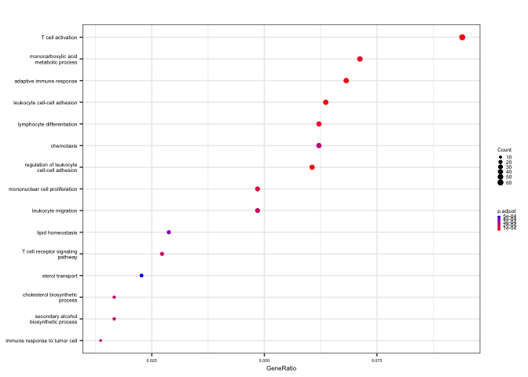

Fig 6 - RNA-sequencing
================
Benjamin Ostendorf
2023/04/24

## Preamble

``` r
library(DESeq2)
library(clusterProfiler)
library(AnnotationDbi)
library(org.Mm.eg.db)
library(tidyverse)

## Color palette
cols_RGX <- c("ctrl" = "#A9A9A8", "tx" = "#0095FF")
```

## Import data

``` r
## Assemble dds object
read_counts <- read.table("counts.tsv", header = TRUE, row.names = "gene")

condition <- factor(c(rep("ctrl", 4), rep("tx", 4)), levels = c("ctrl", "tx"))
sample_info <- data.frame(condition = condition, 
                          row.names = names(read_counts))

dds <- DESeqDataSetFromMatrix(countData = read_counts,
                              colData = sample_info,
                              design = ~ condition)

## Remove uninformative columns
dds <- dds[rowSums(counts(dds)) > 1, ]

## Normalization and preprocessing
dds <- DESeq(dds)

## Get log2-transformed and scaled gene expression data
dds_rlog <- rlog(dds)
counts_norm <- counts(dds, normalized = TRUE)
counts_log2 <- log2(counts_norm + 1)
counts_scaled <- t(scale(t(counts_log2)))

## Get shrunken lfc results
res <- results(dds, contrast = c("condition", "tx", "ctrl"))
resLFC <- 
  lfcShrink(dds, res = res, contrast = c("condition", "tx", "ctrl"), type = "ashr") |>
  as_tibble(rownames = "symbol") |>
  arrange(padj)
```

## Enrichment analysis with Clusterprofiler for GO

``` r
resLFC$entrez <- 
  mapIds(org.Mm.eg.db, 
         keys = resLFC$symbol, 
         keytype = "SYMBOL", 
         column = "ENTREZID")

genes_GO_entrez <- 
  resLFC |>
  filter(!is.na(padj) & padj < 0.1) |>
  filter(log2FoldChange > 0) |>
  pull(entrez)

ego <- enrichGO(gene          = genes_GO_entrez,
                universe      = resLFC$entrez,
                OrgDb         = org.Mm.eg.db,
                ont           = c("BP"), 
                pAdjustMethod = "fdr",
                pvalueCutoff  = 0.05,
                qvalueCutoff  = 0.1)

ego_simp <- clusterProfiler::simplify(ego, cutoff = 0.6, by = "p.adjust", select_fun = min)
ego_simp <- setReadable(ego_simp, 'org.Mm.eg.db', 'ENTREZID')

results_GO <- summary(ego_simp)

theme_dotplot <- 
  theme(
    axis.title = element_text(size = 6), 
    axis.text.x = element_text(size = 5), 
    axis.text.y = element_text(size = 5), 
    legend.text = element_text(size = 5), 
    legend.title = element_text(size = 5)
  )

GO_dotplot <- 
  dotplot(ego_simp, 
          showCategory = 15) +
  theme_dotplot +
  scale_size_continuous(range = c(0.5, 2)) +
  theme(legend.key.size = unit(.1, "cm"), 
        legend.position = "right", 
        axis.text.x = element_text(size = 4))

print(GO_dotplot)
```

<!-- -->

## Session info

``` r
devtools::session_info()
```

    ## ─ Session info ───────────────────────────────────────────────────────────────
    ##  setting  value
    ##  version  R version 4.3.0 (2023-04-21)
    ##  os       macOS 14.1.2
    ##  system   x86_64, darwin20
    ##  ui       X11
    ##  language (EN)
    ##  collate  en_US.UTF-8
    ##  ctype    en_US.UTF-8
    ##  tz       Europe/Berlin
    ##  date     2023-12-04
    ##  pandoc   3.1.1 @ /Applications/RStudio.app/Contents/Resources/app/quarto/bin/tools/ (via rmarkdown)
    ## 
    ## ─ Packages ───────────────────────────────────────────────────────────────────
    ##  package              * version   date (UTC) lib source
    ##  AnnotationDbi        * 1.62.0    2023-04-25 [1] Bioconductor
    ##  ape                    5.7-1     2023-03-13 [1] CRAN (R 4.3.0)
    ##  aplot                  0.1.10    2023-03-08 [1] CRAN (R 4.3.0)
    ##  ashr                   2.2-54    2022-02-22 [1] CRAN (R 4.3.0)
    ##  Biobase              * 2.60.0    2023-04-25 [1] Bioconductor
    ##  BiocGenerics         * 0.46.0    2023-04-25 [1] Bioconductor
    ##  BiocParallel           1.34.0    2023-04-25 [1] Bioconductor
    ##  Biostrings             2.68.0    2023-04-25 [1] Bioconductor
    ##  bit                    4.0.5     2022-11-15 [1] CRAN (R 4.3.0)
    ##  bit64                  4.0.5     2020-08-30 [1] CRAN (R 4.3.0)
    ##  bitops                 1.0-7     2021-04-24 [1] CRAN (R 4.3.0)
    ##  blob                   1.2.4     2023-03-17 [1] CRAN (R 4.3.0)
    ##  cachem                 1.0.7     2023-02-24 [1] CRAN (R 4.3.0)
    ##  callr                  3.7.3     2022-11-02 [1] CRAN (R 4.3.0)
    ##  cli                    3.6.1     2023-03-23 [1] CRAN (R 4.3.0)
    ##  clusterProfiler      * 4.8.1     2023-05-03 [1] Bioconductor
    ##  codetools              0.2-19    2023-02-01 [1] CRAN (R 4.3.0)
    ##  colorspace             2.1-0     2023-01-23 [1] CRAN (R 4.3.0)
    ##  cowplot                1.1.1     2020-12-30 [1] CRAN (R 4.3.0)
    ##  crayon                 1.5.2     2022-09-29 [1] CRAN (R 4.3.0)
    ##  data.table             1.14.8    2023-02-17 [1] CRAN (R 4.3.0)
    ##  DBI                    1.1.3     2022-06-18 [1] CRAN (R 4.3.0)
    ##  DelayedArray           0.25.0    2022-11-01 [1] Bioconductor
    ##  DESeq2               * 1.40.0    2023-04-25 [1] Bioconductor
    ##  devtools               2.4.5     2022-10-11 [1] CRAN (R 4.3.0)
    ##  digest                 0.6.31    2022-12-11 [1] CRAN (R 4.3.0)
    ##  DOSE                   3.26.0    2023-04-25 [1] Bioconductor
    ##  downloader             0.4       2015-07-09 [1] CRAN (R 4.3.0)
    ##  dplyr                * 1.1.2     2023-04-20 [1] CRAN (R 4.3.0)
    ##  ellipsis               0.3.2     2021-04-29 [1] CRAN (R 4.3.0)
    ##  enrichplot             1.20.0    2023-04-25 [1] Bioconductor
    ##  evaluate               0.20      2023-01-17 [1] CRAN (R 4.3.0)
    ##  fansi                  1.0.4     2023-01-22 [1] CRAN (R 4.3.0)
    ##  farver                 2.1.1     2022-07-06 [1] CRAN (R 4.3.0)
    ##  fastmap                1.1.1     2023-02-24 [1] CRAN (R 4.3.0)
    ##  fastmatch              1.1-3     2021-07-23 [1] CRAN (R 4.3.0)
    ##  fgsea                  1.26.0    2023-04-25 [1] Bioconductor
    ##  forcats              * 1.0.0     2023-01-29 [1] CRAN (R 4.3.0)
    ##  fs                     1.6.2     2023-04-25 [1] CRAN (R 4.3.0)
    ##  generics               0.1.3     2022-07-05 [1] CRAN (R 4.3.0)
    ##  GenomeInfoDb         * 1.36.0    2023-04-25 [1] Bioconductor
    ##  GenomeInfoDbData       1.2.10    2023-05-01 [1] Bioconductor
    ##  GenomicRanges        * 1.52.0    2023-04-25 [1] Bioconductor
    ##  ggforce                0.4.1     2022-10-04 [1] CRAN (R 4.3.0)
    ##  ggfun                  0.0.9     2022-11-21 [1] CRAN (R 4.3.0)
    ##  ggplot2              * 3.4.2     2023-04-03 [1] CRAN (R 4.3.0)
    ##  ggplotify              0.1.0     2021-09-02 [1] CRAN (R 4.3.0)
    ##  ggraph                 2.1.0     2022-10-09 [1] CRAN (R 4.3.0)
    ##  ggrepel                0.9.3     2023-02-03 [1] CRAN (R 4.3.0)
    ##  ggtree                 3.8.0     2023-04-25 [1] Bioconductor
    ##  glue                   1.6.2     2022-02-24 [1] CRAN (R 4.3.0)
    ##  GO.db                  3.17.0    2023-05-01 [1] Bioconductor
    ##  GOSemSim               2.26.0    2023-04-25 [1] Bioconductor
    ##  graphlayouts           0.8.4     2022-11-24 [1] CRAN (R 4.3.0)
    ##  gridExtra              2.3       2017-09-09 [1] CRAN (R 4.3.0)
    ##  gridGraphics           0.5-1     2020-12-13 [1] CRAN (R 4.3.0)
    ##  gson                   0.1.0     2023-03-07 [1] CRAN (R 4.3.0)
    ##  gtable                 0.3.3     2023-03-21 [1] CRAN (R 4.3.0)
    ##  HDO.db                 0.99.1    2023-05-01 [1] Bioconductor
    ##  highr                  0.10      2022-12-22 [1] CRAN (R 4.3.0)
    ##  hms                    1.1.3     2023-03-21 [1] CRAN (R 4.3.0)
    ##  htmltools              0.5.5     2023-03-23 [1] CRAN (R 4.3.0)
    ##  htmlwidgets            1.6.2     2023-03-17 [1] CRAN (R 4.3.0)
    ##  httpuv                 1.6.9     2023-02-14 [1] CRAN (R 4.3.0)
    ##  httr                   1.4.5     2023-02-24 [1] CRAN (R 4.3.0)
    ##  igraph                 1.4.2     2023-04-07 [1] CRAN (R 4.3.0)
    ##  invgamma               1.1       2017-05-07 [1] CRAN (R 4.3.0)
    ##  IRanges              * 2.34.0    2023-04-25 [1] Bioconductor
    ##  irlba                  2.3.5.1   2022-10-03 [1] CRAN (R 4.3.0)
    ##  jsonlite               1.8.4     2022-12-06 [1] CRAN (R 4.3.0)
    ##  KEGGREST               1.40.0    2023-04-25 [1] Bioconductor
    ##  knitr                  1.42      2023-01-25 [1] CRAN (R 4.3.0)
    ##  labeling               0.4.2     2020-10-20 [1] CRAN (R 4.3.0)
    ##  later                  1.3.0     2021-08-18 [1] CRAN (R 4.3.0)
    ##  lattice                0.21-8    2023-04-05 [1] CRAN (R 4.3.0)
    ##  lazyeval               0.2.2     2019-03-15 [1] CRAN (R 4.3.0)
    ##  lifecycle              1.0.3     2022-10-07 [1] CRAN (R 4.3.0)
    ##  locfit                 1.5-9.7   2023-01-02 [1] CRAN (R 4.3.0)
    ##  lubridate            * 1.9.2     2023-02-10 [1] CRAN (R 4.3.0)
    ##  magrittr               2.0.3     2022-03-30 [1] CRAN (R 4.3.0)
    ##  MASS                   7.3-58.4  2023-03-07 [1] CRAN (R 4.3.0)
    ##  Matrix                 1.5-4     2023-04-04 [1] CRAN (R 4.3.0)
    ##  MatrixGenerics       * 1.12.0    2023-04-25 [1] Bioconductor
    ##  matrixStats          * 0.63.0    2022-11-18 [1] CRAN (R 4.3.0)
    ##  memoise                2.0.1     2021-11-26 [1] CRAN (R 4.3.0)
    ##  mime                   0.12      2021-09-28 [1] CRAN (R 4.3.0)
    ##  miniUI                 0.1.1.1   2018-05-18 [1] CRAN (R 4.3.0)
    ##  mixsqp                 0.3-48    2022-11-16 [1] CRAN (R 4.3.0)
    ##  munsell                0.5.0     2018-06-12 [1] CRAN (R 4.3.0)
    ##  nlme                   3.1-162   2023-01-31 [1] CRAN (R 4.3.0)
    ##  org.Mm.eg.db         * 3.17.0    2023-05-01 [1] Bioconductor
    ##  patchwork              1.1.2     2022-08-19 [1] CRAN (R 4.3.0)
    ##  pillar                 1.9.0     2023-03-22 [1] CRAN (R 4.3.0)
    ##  pkgbuild               1.4.0     2022-11-27 [1] CRAN (R 4.3.0)
    ##  pkgconfig              2.0.3     2019-09-22 [1] CRAN (R 4.3.0)
    ##  pkgload                1.3.2     2022-11-16 [1] CRAN (R 4.3.0)
    ##  plyr                   1.8.8     2022-11-11 [1] CRAN (R 4.3.0)
    ##  png                    0.1-8     2022-11-29 [1] CRAN (R 4.3.0)
    ##  polyclip               1.10-4    2022-10-20 [1] CRAN (R 4.3.0)
    ##  prettyunits            1.1.1     2020-01-24 [1] CRAN (R 4.3.0)
    ##  processx               3.8.1     2023-04-18 [1] CRAN (R 4.3.0)
    ##  profvis                0.3.7     2020-11-02 [1] CRAN (R 4.3.0)
    ##  promises               1.2.0.1   2021-02-11 [1] CRAN (R 4.3.0)
    ##  ps                     1.7.5     2023-04-18 [1] CRAN (R 4.3.0)
    ##  purrr                * 1.0.1     2023-01-10 [1] CRAN (R 4.3.0)
    ##  qvalue                 2.32.0    2023-04-25 [1] Bioconductor
    ##  R6                     2.5.1     2021-08-19 [1] CRAN (R 4.3.0)
    ##  RColorBrewer           1.1-3     2022-04-03 [1] CRAN (R 4.3.0)
    ##  Rcpp                   1.0.10    2023-01-22 [1] CRAN (R 4.3.0)
    ##  RCurl                  1.98-1.12 2023-03-27 [1] CRAN (R 4.3.0)
    ##  readr                * 2.1.4     2023-02-10 [1] CRAN (R 4.3.0)
    ##  remotes                2.4.2     2021-11-30 [1] CRAN (R 4.3.0)
    ##  reshape2               1.4.4     2020-04-09 [1] CRAN (R 4.3.0)
    ##  rlang                  1.1.1     2023-04-28 [1] CRAN (R 4.3.0)
    ##  rmarkdown              2.21      2023-03-26 [1] CRAN (R 4.3.0)
    ##  RSQLite                2.3.1     2023-04-03 [1] CRAN (R 4.3.0)
    ##  rstudioapi             0.14      2022-08-22 [1] CRAN (R 4.3.0)
    ##  S4Vectors            * 0.38.0    2023-04-25 [1] Bioconductor
    ##  scales                 1.2.1     2022-08-20 [1] CRAN (R 4.3.0)
    ##  scatterpie             0.1.9     2023-04-22 [1] CRAN (R 4.3.0)
    ##  sessioninfo            1.2.2     2021-12-06 [1] CRAN (R 4.3.0)
    ##  shadowtext             0.1.2     2022-04-22 [1] CRAN (R 4.3.0)
    ##  shiny                  1.7.4     2022-12-15 [1] CRAN (R 4.3.0)
    ##  SQUAREM                2021.1    2021-01-13 [1] CRAN (R 4.3.0)
    ##  stringi                1.7.12    2023-01-11 [1] CRAN (R 4.3.0)
    ##  stringr              * 1.5.0     2022-12-02 [1] CRAN (R 4.3.0)
    ##  SummarizedExperiment * 1.30.0    2023-04-25 [1] Bioconductor
    ##  tibble               * 3.2.1     2023-03-20 [1] CRAN (R 4.3.0)
    ##  tidygraph              1.2.3     2023-02-01 [1] CRAN (R 4.3.0)
    ##  tidyr                * 1.3.0     2023-01-24 [1] CRAN (R 4.3.0)
    ##  tidyselect             1.2.0     2022-10-10 [1] CRAN (R 4.3.0)
    ##  tidytree               0.4.2     2022-12-18 [1] CRAN (R 4.3.0)
    ##  tidyverse            * 2.0.0     2023-02-22 [1] CRAN (R 4.3.0)
    ##  timechange             0.2.0     2023-01-11 [1] CRAN (R 4.3.0)
    ##  treeio                 1.24.0    2023-04-25 [1] Bioconductor
    ##  truncnorm              1.0-9     2023-03-20 [1] CRAN (R 4.3.0)
    ##  tweenr                 2.0.2     2022-09-06 [1] CRAN (R 4.3.0)
    ##  tzdb                   0.4.0     2023-05-12 [1] CRAN (R 4.3.0)
    ##  urlchecker             1.0.1     2021-11-30 [1] CRAN (R 4.3.0)
    ##  usethis                2.1.6     2022-05-25 [1] CRAN (R 4.3.0)
    ##  utf8                   1.2.3     2023-01-31 [1] CRAN (R 4.3.0)
    ##  vctrs                  0.6.2     2023-04-19 [1] CRAN (R 4.3.0)
    ##  viridis                0.6.2     2021-10-13 [1] CRAN (R 4.3.0)
    ##  viridisLite            0.4.1     2022-08-22 [1] CRAN (R 4.3.0)
    ##  withr                  2.5.0     2022-03-03 [1] CRAN (R 4.3.0)
    ##  xfun                   0.39      2023-04-20 [1] CRAN (R 4.3.0)
    ##  xtable                 1.8-4     2019-04-21 [1] CRAN (R 4.3.0)
    ##  XVector                0.40.0    2023-04-25 [1] Bioconductor
    ##  yaml                   2.3.7     2023-01-23 [1] CRAN (R 4.3.0)
    ##  yulab.utils            0.0.6     2022-12-20 [1] CRAN (R 4.3.0)
    ##  zlibbioc               1.46.0    2023-04-25 [1] Bioconductor
    ## 
    ##  [1] /Library/Frameworks/R.framework/Versions/4.3-x86_64/Resources/library
    ## 
    ## ──────────────────────────────────────────────────────────────────────────────
